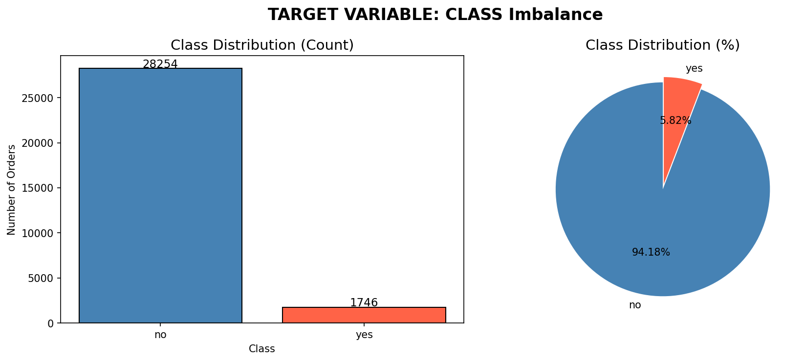
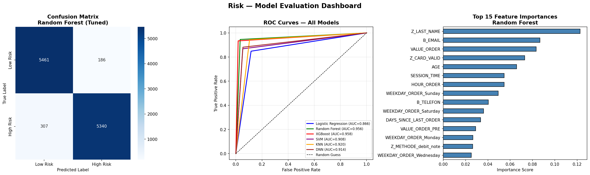

# 🛒 Default Risk Prediction — Online Purchase Orders Classification

> **Machine Learning Project**
> 
> Professional Development
> 
> Focus: Binary Classification | Fraud Detection | Risk Assessment

---

## 📋 Project Overview

This project builds a machine learning classification system 
that predicts whether an online purchase order is **high risk** 
or **low risk** for payment default.

An online retailer processes thousands of orders daily. Some 
customers place orders with no intention of paying, resulting 
in financial loss. This model helps the retailer automatically 
flag suspicious orders before they are fulfilled.

| Detail | Value |
|---|---|
| Dataset | 30,000 online purchase orders |
| Features | 44 attributes per order |
| Target | `CLASS` — yes (high risk) / no (low risk) |
| Problem Type | Binary Classification |
| Primary Metric | F1-Score on high-risk class |
| Target F1-Score | ≥ 70% |
| Achieved F1-Score | **96%** ✅ |

---

## 🎯 Business Problem

A retailer offering deferred payment options needs to identify 
orders likely to result in non-payment before shipping goods.

**The cost of errors:**
- **False Negative** (missed fraudster) → goods shipped, 
  bill never paid → direct financial loss
- **False Positive** (legitimate customer blocked) → 
  customer friction, lost sale → recoverable

This asymmetry makes **False Negatives the most critical 
error** — and explains why F1-Score is prioritised over 
accuracy as the primary evaluation metric.

---

## 📁 Project Structure
Default-Risk-Prediction/

│

├── risk.ipynb                  ← Main project notebook

├── class_distribution.png      ← Class imbalance visualisation

├── model_evaluation.png        ← Model evaluation dashboard

├── risk-dataset.txt            ← Dataset attribute descriptions

└── README.md                   ← Project documentation
---

## 🔧 Technical Approach

### Data Preprocessing
- Removed irrelevant features (`ORDER_ID`, `ANUMMER_01–10`)
- Dropped 20 rows with missing `TIME_ORDER` values (0.06%)
- Applied three encoding strategies:
  - **Binary encoding** — yes/no columns → 1/0
  - **Ordinal encoding** — reminder stage columns (natural order)
  - **One-Hot encoding** — payment method, card type, weekday

### Feature Engineering
Three new features extracted from raw date/time columns:

| Original | New Feature | Reasoning |
|---|---|---|
| `TIME_ORDER` | `HOUR_ORDER` | Late night orders signal higher risk |
| `B_BIRTHDATE` | `AGE` | Age correlates with credit history |
| `DATE_LORDER` | `DAYS_SINCE_LAST_ORDER` | Recency indicates customer reliability |

### Class Imbalance
The dataset was severely imbalanced:
- Low risk (`no`) : 28,235 orders — **94.18%**
- High risk (`yes`):  1,745 orders —  **5.82%**

**SMOTE** (Synthetic Minority Oversampling Technique) was 
applied to generate synthetic high-risk orders, balancing 
both classes to 28,235 each before training.

---

## 🤖 Models Trained

Six classification algorithms were trained and evaluated:

| Model | F1 (yes) | ROC-AUC | False Neg | False Pos |
|---|---|---|---|---|
| Logistic Regression | 0.87 | 0.88 | 833 | 548 |
| **Random Forest ⭐** | **0.96** | **0.9563** | **307** | **186** |
| XGBoost | 0.96 | 0.9590 | 367 | 96 |
| SVM | 0.90 | 0.91 | 743 | 296 |
| KNN | 0.92 | 0.92 | 318 | 591 |
| DNN | 0.91 | 0.91 | 644 | 318 |

---

## 🏆 Best Model — Random Forest (Tuned)

Random Forest was selected as the best model based on:

1. **Highest F1-Score** (0.96) on the high-risk class
2. **Lowest False Negatives** (307) — catches the most fraudsters
3. **Strong ROC-AUC** (0.9563)
4. **Best business trade-off** between catching fraud and 
   minimising legitimate customer friction

Hyperparameter tuning via `RandomizedSearchCV` confirmed 
the baseline model was already near-optimal:

```python
Best Parameters:
  n_estimators      : 100
  max_depth         : None
  min_samples_split : 2
  min_samples_leaf  : 1
  max_features      : sqrt
```

---

## 🔍 Key Findings

### Top 3 Most Predictive Features

| Feature | Business Meaning |
|---|---|
| `Z_LAST_NAME` | Name mismatch signals stolen or misused identity |
| `B_EMAIL` | Missing email reduces accountability and traceability |
| `VALUE_ORDER` | High order value increases financial fraud incentive |

### Why the Model Works
These three features capture the core fraud patterns:
- **Identity mismatch** → stolen card or synthetic identity
- **Lack of traceability** → customer harder to contact or verify
- **Financial incentive** → high value orders attract more fraud 
  attempts, especially when combined with weak identity signals

---

## 📊 Visualisations

**Class Distribution**  


**Model Evaluation Dashboard**  


---

## 🛠️ Technology Stack

| Tool | Purpose |
|---|---|
| Python 3.9 | Core programming language |
| pandas | Data manipulation |
| numpy | Numerical computation |
| matplotlib / seaborn | Visualisation |
| scikit-learn | ML models and evaluation |
| imbalanced-learn | SMOTE implementation |
| XGBoost | Gradient boosting model |
| TensorFlow / Keras | Deep neural network |
| Jupyter Notebook | Development environment |

---

## ⚙️ How to Run

### 1. Clone the Repository
```bash
git clone https://github.com/odoffin/Default-Risk-Prediction.git
cd Default-Risk-Prediction
```

### 2. Create Virtual Environment
```bash
python3 -m venv .venv
source .venv/bin/activate
```

### 3. Install Dependencies
```bash
pip install pandas numpy scikit-learn imbalanced-learn \
            xgboost matplotlib seaborn tensorflow-macos
```

### 4. Add the Dataset
Place `Risk.csv` in the project root directory.  
*(Dataset not included in repository — contains order data)*

### 5. Run the Notebook
Open `risk.ipynb` in VS Code or Jupyter and run all cells 
from top to bottom.

---

## 📈 Results Summary
Project Target  : F1-Score ≥ 70% on high-risk class

Achieved        : F1-Score = 96% ✅ (+26% above target)
Best Model      : Random Forest (Tuned)

Accuracy        : 96%

Precision       : 97%

Recall          : 95%

F1-Score        : 96%

ROC-AUC         : 0.9563

False Negatives : 307 (lowest across all models)
---

## 👤 Author

**Ade**    
Machine Learning Classification Project  
Spring 2026

---

## 📄 License

This project is created for educational purposes as part of 
my professional development.

---

*Built with Python · scikit-learn · TensorFlow · GitHub*
